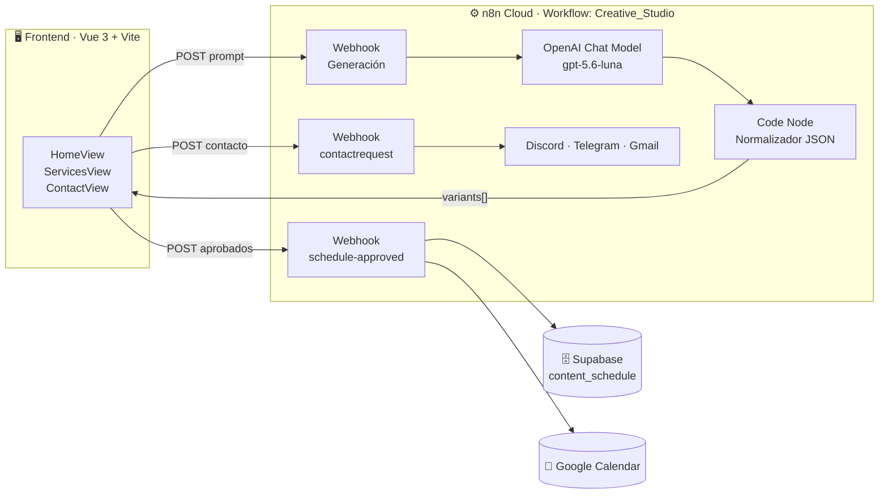

<div align="center">

# 🧠 OmniStudio AI

### 🚀 Central de Inteligencia de Generación de Contenido


**OmniStudio AI** transforma una única premisa editorial en **5 piezas de contenido omnicanal** (Hilos, Artículos, Boletines, Videos y Audios) mediante un pipeline automatizado con **IA generativa**, permitiendo aprobar, editar y **programar la publicación** directamente en Supabase y Google Calendar.

</div>

---

## 📖 Descripción técnica

| Capa | Tecnología | Rol |
|---|---|---|
| **Frontend SPA** | Vue 3.5 (Composition API + `<script setup>`) · TypeScript ~6.0 · Vite 8 | Interfaz reactiva y tipada del estudio creativo |
| **Estilos & UX** | Tailwind CSS v4 (plugin `@tailwindcss/vite`) · SweetAlert2 v11 | Diseño dark-first, alertas modales y toasts temáticos |
| **Orquestación** | n8n Cloud (workflow `Creative_Studio`) | Backend sin servidor basado en webhooks |
| **IA Generativa** | OpenAI · modelo `gpt-5.6-luna` | Redacción editorial multiformato |
| **Persistencia** | Supabase (tabla `content_schedule`) | Registro de publicaciones programadas |
| **Agenda** | Google Calendar API (OAuth2) | Creación automática de eventos de publicación |
| **Alerting** | Discord Webhooks · Telegram Bot API · Gmail | Notificación multicanal instantánea |

El proyecto no requiere backend propio: el frontend se comunica directamente con **3 webhooks de n8n**, que encapsulan toda la lógica de negocio (LLM, base de datos, calendario y notificaciones).

---

## ✨ Características principales

- 🔁 **Generación omnicanal**: 1 premisa → 5 variantes simultáneas optimizadas por formato.
- 🎛️ **Control editorial**: selector de tono, audiencia objetivo e idioma de salida (ES/EN).
- ♻️ **Regeneración granular**: reescritura individual de cada pieza sin perder las demás.
- ✅ **Flujo de aprobación**: marca variantes como *Aprobado* y sincronízalas en lote.
- 📅 **Programación automática**: las piezas aprobadas se registran en Supabase y se agendan en Google Calendar (espaciadas 2 horas entre sí).
- 🕘 **Historial persistente**: sesiones de premisas guardadas en `localStorage`.
- 🌐 **n8n integrado**: diccionario bilingüe ES/EN conmutable en caliente.
- 📤 **Exportación**: descarga de contenido en `.md`, `.json` o `.txt`.
- 🔔 **Alertas omnicanal**: el formulario de contacto dispara Discord + Telegram + Gmail en paralelo.

---

## 🏗️ Arquitectura del Sistema



### 🖥️ Arquitectura Frontend

Aplicación **SPA construida con Vite**, escrita íntegramente en **TypeScript** con la **Composition API de Vue 3** (`<script setup>` SFCs). La lógica reutilizable se centraliza en **Composables**:

| Composable | Responsabilidad | Persistencia |
|---|---|---|
| `useLanguage.ts` | Estado global de idioma (`es`/`en`), diccionario reactivo `t` (computed) y `toggleLang()` | `localStorage → omnistudio_lang_pref` |
| `useHistory.ts` | CRUD de sesiones de premisas (`saveSession`, `updateCurrentSession`, `deleteSession`), sesión activa y tipos `SessionHistoryItem` / `VariantItem` | `localStorage → omnistudio_chat_history` |

Ambos composables usan estado module-scope (singleton) + `watch` profundo para sincronizar automáticamente con `localStorage`.

**Configuración de rutas** — definida en `src/Router/index.ts` con `createWebHistory` y aliases bilingües:

| Ruta | Alias | Vista | Descripción |
|---|---|---|---|
| `/` | — | `HomeView.vue` | Estudio creativo: generación, edición, aprobación y programación |
| `/engines` | `/services`, `/motores` | `ServicesView.vue` | Catálogo de motores y formatos omnicanal |
| `/contact` | `/soporte` | `ContactView.vue` | Formulario de soporte conectado al webhook de alertas |

**Stack detallado:**

| Tecnología | Versión | Uso en el proyecto |
|---|---|---|
| Vue | `^3.5.40` | Framework UI con Composition API |
| TypeScript | `~6.0.2` | Tipado estricto (`vue-tsc -b` en el build) |
| Vite | `^8.2.0` | Dev server + bundler (`@vitejs/plugin-vue`) |
| vue-router | `^4.6.4` | Enrutamiento SPA con aliases |
| Tailwind CSS | `^4.3.3` | Estilos utility-first vía plugin oficial de Vite (configuración CSS-first en `src/style.css`, sin `tailwind.config.js`) |
| SweetAlert2 | `^11.26.25` | Modales y toasts personalizados (helpers `notify()` / `notifyToast()`) |

### ⚙️ Backend · Automatización con n8n Cloud

Workflow único llamado **`Creative_Studio`** (exportado en [`Omni.json`](./Omni.json)), alojado en la instancia Cloud `devaidiego.app.n8n.cloud`. Credenciales gestionadas por el gestor seguro de n8n:

| Credencial en n8n | Nodo(s) que la usan | Tipo |
|---|---|---|
| OpenAI account | OpenAI Chat Model | `openAiApi` |
| Supabase account | Create a row | `supabaseApi` |
| Google Calendar account | Create an event | `googleCalendarOAuth2Api` |
| Discord Webhook account | Alerta Discord | `discordWebhookApi` |
| Telegram account | Alerta Telegram | `telegramApi` |
| Gmail account | Send a message | `gmailOAuth2` |

---

## 🔁 Flujos de Automatización (n8n)

### 1️⃣ Flujo Principal — Generación de Contenido

```
Webhook (POST) ──► Basic LLM Chain ──► Code in JavaScript ──► Respond to Webhook
                        ▲                    (parseo JSON +
                 OpenAI Chat Model            fallback Regex)
                  gpt-5.6-luna
```

1. **Webhook** recibe la premisa con CORS restrictivo (`allowedOrigins: http://localhost:5173`).
2. **Basic LLM Chain** construye el prompt de "director editorial" combinando tono, audiencia, idioma y formato solicitado; el nodo **OpenAI Chat Model** (`gpt-5.6-luna`) devuelve JSON estructurado.
3. **Code in JavaScript** limpia fences markdown (```` ```json ````), parsea la respuesta y aplica un **fallback por Regex** si el JSON es inválido, normalizando siempre los 5 formatos.
4. **Respond to Webhook** devuelve HTTP 200 con el array de variantes.

**Payload de entrada:**
```json
{
  "prompt": "La IA generativa en la educación superior",
  "tone": "Directo & Viral",
  "audience": "Creadores & Emprendedores",
  "language": "Español",
  "targetFormat": "TODOS"
}
```

**Respuesta:**
```json
{
  "variants": [
    {
      "id": "1",
      "format": "Hilos",
      "title": "...",
      "content": "...",
      "isApproved": false,
      "durationOrLength": "5 Tweets",
      "tag": "X / Twitter"
    }
  ]
}
```

> 💡 Si `targetFormat` indica un solo formato (ej. `"Hilos"`), el flujo regenera únicamente esa variante bajo el tono/audiencia dados.

### 2️⃣ Flujo de Contacto

```
Webhook Contacto (POST) ──► Detector de Datos ──┬─► Alerta Discord   (webhook)
                                                ├─► Alerta Telegram  (Bot API)
                                                ├─► Send a message   (Gmail HTML)
                                                └─► Responder Frontend ({success:true})
```

1. **Webhook** (`POST /webhook/contactrequest`) recibe el formulario.
2. **Detector de Datos** normaliza y protege el payload con valores por defecto (`name`, `email`, `channel`, `message`, `timestamp`).
3. **Fan-out paralelo**: la misma solicitud se difunde simultáneamente a Discord (webhook embebido), Telegram (chat ID configurado, modo Markdown) y Gmail (plantilla HTML responsive a los destinatarios del equipo).
4. **Responder Frontend** devuelve `{ success: true }` con cabeceras CORS explícitas.

**Payload:** `{ "name", "email", "channel", "message" }`

### 3️⃣ Flujo Disparador de Publicación — Integración Supabase + Google Calendar

```
Schedule (POST) ──► Code in JavaScript1 ──┬─► Create a row (Supabase)     ──► Respond {success:true}
                                          └─► Create an event (Calendar)  ──┘
```

1. **Webhook** (`POST /webhook/schedule-approved`) recibe `{ approvedVariants: [...] }` desde el botón *"Programar"*.
2. **Code in JavaScript1** valida que existan variantes aprobadas y calcula la agenda: cada pieza se programa **con 2 horas de diferencia** respecto a la anterior, con duración de evento de **30 minutos** y `status: 'scheduled'`.
3. Escritura **dual y paralela**:
   - 🗄️ **Supabase** → inserta una fila por variante en la tabla `content_schedule`.
   - 📅 **Google Calendar** → crea el evento `[Formato] Título` en el calendario *Creative_Studio*, con la plataforma, estado y guion completo en la descripción.
4. **Respond to Webhook** confirma con `{ "success": true }`.

---

## 🗄️ Arquitectura de Base de Datos — Supabase

Tabla **`content_schedule`** (PostgreSQL), alimentada por n8n con las piezas aprobadas:

| Columna | Tipo | Descripción |
|---|---|---|
| `id` | `uuid` (PK) | Identificador autogenerado |
| `title` | `text` | Título de la pieza |
| `content` | `text` | Contenido/guion completo generado por IA |
| `format` | `text` | Formato: `Hilos` · `Artículos` · `Boletines` · `Videos` · `Audios` |
| `platform` | `text` | Canal destino: `X / Twitter`, `Blog / Medium`, `Substack`, `YouTube Shorts`, `Audiograma` |
| `created_at` | `timestamptz` | Fecha/hora de publicación programada |
| `status` | `text` | Estado del ciclo de vida (default `'scheduled'`) |

```sql
create table if not exists public.content_schedule (
  id         uuid primary key default gen_random_uuid(),
  title      text not null,
  content    text,
  format     text,
  platform   text,
  created_at timestamptz,
  status     text default 'scheduled'
);
```

---

## 📂 Estructura del Proyecto

Proyecto generado con **Vite + TypeScript**, organizado bajo la filosofía de **Composables** para extraer lógica reutilizable fuera de los componentes:

```
AI-Sprint-Team/
├── index.html                  # Punto de entrada HTML
├── package.json                # Dependencias y scripts npm
├── vite.config.ts              # Vite 8 + plugin Vue + plugin Tailwind v4
├── tsconfig.json               # Configuración TS monorepo (app/node)
├── Omni.json                   # Exportación del workflow n8n "Creative_Studio"
├── .env.example                # Plantilla de variables de entorno
├── public/                     # Assets estáticos servidos tal cual
└── src/
    ├── main.ts                 # Bootstrap: createApp + router
    ├── App.vue                 # Shell principal + layout
    ├── style.css               # Tailwind CSS v4 (config CSS-first)
    ├── Router/
    │   └── index.ts            # createRouter: rutas, aliases ES/EN
    ├── assets/                 # Recursos importados por Vite
    ├── components/
    │   └── layout/
    │       ├── Header.vue      # Barra superior + búsqueda
    │       ├── SideBar.vue     # Navegación lateral + historial
    │       └── Footer.vue      # Estado del sistema
    ├── composables/
    │   ├── useLanguage.ts      # i18n ES/EN persistente
    │   └── useHistory.ts       # Historial de sesiones persistente
    └── views/
        ├── HomeView.vue        # Estudio creativo (flujo principal)
        ├── ServicesView.vue    # Motores & formatos
        └── ContactView.vue     # Soporte & central de webhooks
```

---

## 🔐 Variables de Entorno

Copia la plantilla y ajusta valores:

```bash
cp .env.example .env
```

Vite solo expone al cliente las variables con prefijo `VITE_`. Acceso desde código: `import.meta.env.VITE_N8N_GENERATE_URL`.

| Variable | Ámbito | Ejemplo |
|---|---|---|
| `VITE_N8N_GENERATE_URL` | Frontend | `https://devaidiego.app.n8n.cloud/webhook/39fb0e03-…` |
| `VITE_N8N_CONTACT_URL` | Frontend | `https://devaidiego.app.n8n.cloud/webhook/contactrequest` |
| `VITE_N8N_SCHEDULE_URL` | Frontend | `https://devaidiego.app.n8n.cloud/webhook/schedule-approved` |
| `VITE_SUPABASE_URL` | Frontend | `https://TU_PROYECTO.supabase.co` |
| `VITE_SUPABASE_ANON_KEY` | Frontend | Clave pública anon del proyecto |
| `OPENAI_API_KEY` | ⚠️ Solo n8n/backend | `sk-proj-…` — **nunca** en el frontend |

> ℹ️ **Nota de migración**: actualmente las URLs de los webhooks están definidas como constantes en `HomeView.vue` y `ContactView.vue`. Se recomienda reemplazarlas por `import.meta.env.VITE_*` usando esta plantilla. Las credenciales de Supabase (service role), Google, Telegram, Discord y Gmail viven exclusivamente en el gestor de credenciales de n8n.

**CORS**: los nodos webhook aceptan origen `http://localhost:5173` (desarrollo). Al desplegar a producción, añade tu dominio real (p. ej. `https://tudominio.com`) en *Settings → Allowed Origins* de cada nodo Webhook.

---

## 🚀 Instalación y Ejecución Local

### Prerrequisitos

- **Node.js ≥ 20.19** (LTS) y npm ≥ 10
- Una instancia **n8n** activa con las credenciales configuradas (ver tabla de credenciales)
- Proyecto **Supabase** con la tabla `content_schedule` creada

### Pasos

```bash
# 1. Clonar el repositorio
git clone https://github.com/tu-usuario/AI-Sprint-Team.git
cd AI-Sprint-Team

# 2. Instalar dependencias
npm install

# 3. Configurar variables de entorno
cp .env.example .env   # luego edita los valores

# 4. Arrancar el servidor de desarrollo
npm run dev
```

Abre **http://localhost:5173** (origen autorizado en los webhooks).

### Scripts disponibles

| Comando | Acción |
|---|---|
| `npm run dev` | Servidor de desarrollo con HMR (Vite) |
| `npm run build` | Type-check con `vue-tsc -b` + build de producción en `dist/` |
| `npm run preview` | Sirve el build localmente para verificación |

### Importar el workflow de n8n

1. Entra a tu instancia de n8n (**Cloud** o self-hosted).
2. `Workflows → ⋯ → Import from File…` y selecciona **`Omni.json`**.
3. Vincula las 6 credenciales listadas en la sección de arquitectura backend.
4. Pulsa **Activate** para habilitar las URLs de producción (`/webhook/...`).
   Para probar sin activar, usa **Test workflow** y cambia las URLs a `/webhook-test/...`.

---

## 🛠️ Solución de Problemas (Troubleshooting APIs)

| # | Síntoma | Causa probable | Solución |
|---|---|---|---|
| 1 | `Blocked by CORS policy` en consola | El origen no está en `allowedOrigins` del nodo Webhook | Añade `http://localhost:5173` (dev) o `https://tudominio.com` (prod) en cada nodo Webhook de n8n |
| 2 | `404 · {"message":"webhook not registered"}` | URL de producción con el workflow inactivo, o URL de test sin ejecutar | Activa el workflow en n8n, o usa `/webhook-test/` pulsando antes **Test workflow** |
| 3 | `401 · invalid_api_key` (OpenAI) | Credencial caducada o revocada | Regenera la API key en OpenAI y actualiza la credencial *OpenAI account* en n8n |
| 4 | `404 · model_not_found: gpt-5.6-luna` | La cuenta/org no tiene acceso al modelo | Verifica acceso al modelo en la organización de OpenAI o selecciona un modelo alternativo en el nodo |
| 5 | Error insertando en Supabase (`new row violates row-level security`) | RLS habilitado sin políticas para la credencial usada | Usa credencial con rol adecuado (service role) en el nodo *Create a row* o crea la política correspondiente |
| 6 | `relation "content_schedule" does not exist` | Tabla no creada | Ejecuta el SQL de la sección Base de Datos en el SQL Editor de Supabase |
| 7 | Google Calendar: `401/403 invalid_grant` | Token OAuth expirado o permisos insuficientes | Reconecta la credencial *Google Calendar account* y verifica scope `calendar.events` |
| 8 | Telegram: `400 · chat not found` | Chat ID incorrecto o el bot nunca fue iniciado | Envía `/start` al bot desde la cuenta destino y confirma el `chatId` numérico |
| 9 | Discord: webhook responde `404` | URL del webhook revocada | Regenera la URL en los ajustes del canal y actualiza la credencial |
| 10 | Gmail: `invalid to/from header` | Destinatarios mal formateados | Revisa la lista `sendTo` separada por comas en el nodo Gmail |
| 11 | El historial desaparece al recargar | `localStorage` limpiado o modo incógnito | El historial persiste por navegador en `omnistudio_chat_history`; exporta el contenido si necesitas respaldo |
| 12 | `npm run build` falla con errores TS | Tipos desactualizados tras cambiar dependencias | Borra `node_modules` y `dist`, reinstala con `npm install` y vuelve a ejecutar |

---

## 🖼️ Vista previa

<!-- TODO: Añadir capturas de pantalla de la interfaz (HomeView, ServicesView, ContactView) -->
> 📸 *Capturas de pantalla próximamente.*

---

## 👥 Equipo

| Integrantes |
|---|
| **Diego Andres Rodriguez Arrieta** |
| **Miguel Fernando Daza Hernandez** |
| **Andres Felipe Blanco Centeno** |

---

## 📄 Licencia

Este proyecto está distribuido bajo la licencia [MIT](https://opensource.org/licenses/MIT).
Eres libre de usar, copiar, modificar y distribuir este software con atribución.

<div align="center">

Hecho con Vue y n8n por el equipo **AI-Sprint-NSTeam**

</div>
